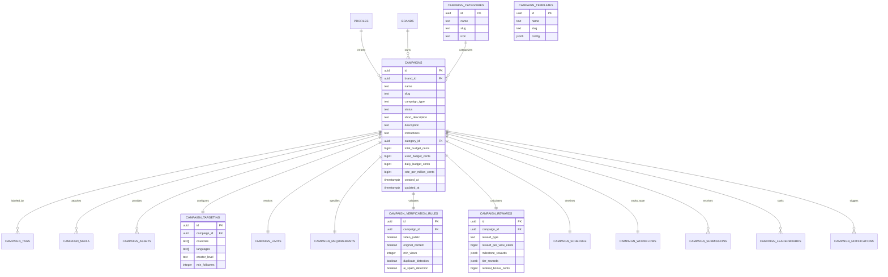

# Campaign Management System - Entity Relationship Diagram

```mermaid
erDiagram
    PROFILES ||--o{ CAMPAIGNS : creates
    BRANDS ||--o{ CAMPAIGNS : owns
    CAMPAIGN_CATEGORIES ||--o{ CAMPAIGNS : categorizes
    CAMPAIGNS ||--o{ CAMPAIGN_TAGS : labeled_by
    CAMPAIGNS ||--o{ CAMPAIGN_MEDIA : attaches
    CAMPAIGNS ||--o{ CAMPAIGN_ASSETS : provides
    CAMPAIGNS ||--|| CAMPAIGN_TARGETING : configures
    CAMPAIGNS ||--|| CAMPAIGN_LIMITS : restricts
    CAMPAIGNS ||--|| CAMPAIGN_REQUIREMENTS : specifies
    CAMPAIGNS ||--|| CAMPAIGN_VERIFICATION_RULES : validates
    CAMPAIGNS ||--|| CAMPAIGN_REWARDS : calculates
    CAMPAIGNS ||--|| CAMPAIGN_SCHEDULE : timelines
    CAMPAIGNS ||--|| CAMPAIGN_WORKFLOWS : tracks_state
    CAMPAIGNS ||--o{ CAMPAIGN_SUBMISSIONS : receives
    CAMPAIGNS ||--o{ CAMPAIGN_LEADERBOARDS : ranks
    CAMPAIGNS ||--o{ CAMPAIGN_NOTIFICATIONS : triggers

    CAMPAIGNS {
        uuid id PK
        uuid brand_id FK
        text name
        text slug
        text campaign_type
        text status
        text short_description
        text description
        text instructions
        uuid category_id FK
        bigint total_budget_cents
        bigint used_budget_cents
        bigint daily_budget_cents
        bigint rate_per_million_cents
        timestamptz created_at
        timestamptz updated_at
    }

    CAMPAIGN_CATEGORIES {
        uuid id PK
        text name
        text slug
        text icon
    }

    CAMPAIGN_TARGETING {
        uuid id PK
        uuid campaign_id FK
        text[] countries
        text[] languages
        text creator_level
        integer min_followers
    }

    CAMPAIGN_VERIFICATION_RULES {
        uuid id PK
        uuid campaign_id FK
        boolean video_public
        boolean original_content
        integer min_views
        boolean duplicate_detection
        boolean ai_spam_detection
    }

    CAMPAIGN_REWARDS {
        uuid id PK
        uuid campaign_id FK
        text reward_type
        bigint reward_per_view_cents
        jsonb milestone_rewards
        jsonb tier_rewards
        bigint referral_bonus_cents
    }

    CAMPAIGN_TEMPLATES {
        uuid id PK
        text name
        text slug
        jsonb config
    }
```
