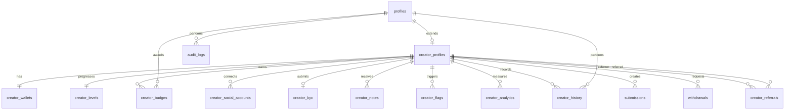

# Creator Management ER Diagram

`creator_wallets` is the creator-management projection. The authoritative existing wallet balance remains synchronized in `wallets`, and adjustments are represented in immutable `wallet_transactions`. This preserves current finance and withdrawal integrations while adding locked, bonus, referral, and freeze controls.
